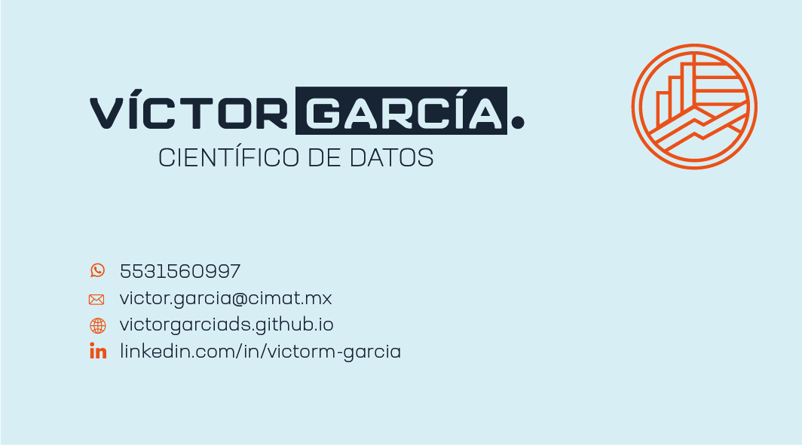

# Portafolio profesional de Víctor Miguel García Sánchez
Soy Víctor Miguel García Sánchez y soy Licenciado en Matemáticas especializado en estadística y muestreo. Actualmente me encuentro en búsqueda activa de empleo mientras termino mis trámites de titulación como Maestro en Ciencias Matemáticas con orientación en Finanzas Matemáticas. 

Agradezco al proyecto html-freebie-portfolio-perfect por la plantilla de la página web y al proyecto <a href="https://github.com/timelyportfolio/leaftime/issues/1#issuecomment-635742475">timelyportfolio</a>.

Agradecimiento a <a href="https://unsplash.com/@pakata">Pakata Goh</a> por permitirme usar sus imágenes.

Iconos de banderas diseñados por <a href="https://www.flaticon.es/autores/freepik" title="Freepik">Freepik</a> from <a href="https://www.flaticon.es/" title="Flaticon"> www.flaticon.es</a>

